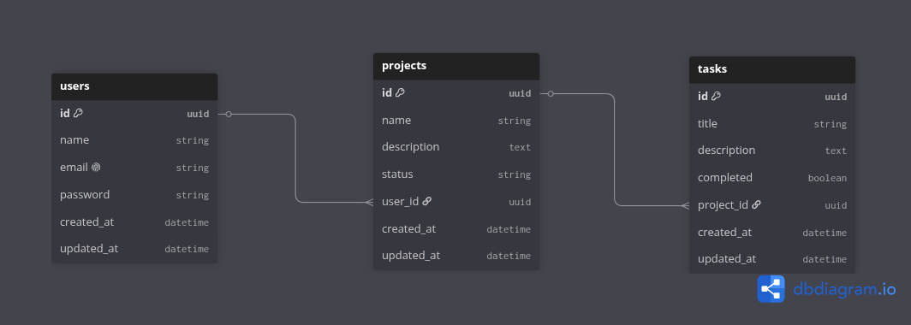

# 🚀 ProjectTaskFlow

Aplicación para organizar proyectos y tareas. Incluye una API REST con **Node.js**, **Express 5**, **Sequelize** y **PostgreSQL**, y un frontend en **React** con **Vite**.

---

## 📌 Tabla de Contenidos

- [Características](#-características)
- [Arquitectura del Proyecto](#-arquitectura-del-proyecto)
- [Modelo de Datos](#-modelo-de-datos)
- [Tecnologías Utilizadas](#-tecnologías-utilizadas)
- [Requisitos Previos](#-requisitos-previos)
- [Instalación y Configuración](#instalación-y-configuración)
- [Variables de Entorno](#-variables-de-entorno)
- [Ejecución](#-ejecución)
- [Funciones de la Aplicación](#-funciones-de-la-aplicación)
- [Documentación Interactiva (Swagger)](#-documentación-interactiva-swagger)
- [Endpoints Principales](#-endpoints-principales)
- [Scripts Disponibles](#-scripts-disponibles)
- [Licencia](#licencia)

---

## ✨ Características

- 🔐 **Autenticación y Autorización**: Registro y login de usuarios con contraseñas encriptadas mediante `bcrypt` y protección de rutas con tokens **JWT**.
- 📁 **Gestión de Proyectos**: Operaciones CRUD completas para proyectos asociados al usuario autenticado, incluyendo eliminación lógica (_soft delete_).
- ✅ **Gestión de Tareas**: Crear, listar, editar y eliminar tareas, cambiar su estado y consultar los resultados paginados (`page`, `limit`).
- ⚛️ **Frontend React**: Dashboard con resumen, selección y edición de proyectos, lista de tareas con búsqueda y filtros, formularios, paginación y estados de carga y error.
- 🛡️ **Seguridad**: Cabeceras HTTP seguras con `helmet` y soporte de `cors`.
- 🔎 **Validación de Datos**: Validación de esquemas y parámetros en peticiones mediante `express-validator`.
- 📜 **Logging Estructurado**: Registro de eventos y peticiones HTTP con `pino` y `pino-pretty`.
- 📖 **Documentación Swagger**: Especificación OpenAPI 3.0 visualizable desde el navegador.

---

## 🏗 Arquitectura del Proyecto

El código está estructurado siguiendo una arquitectura desacoplada en capas:

```text
.
├── client/                 # Frontend React y configuración Vite
│   └── src/                # Pantallas, componentes, contexto y cliente HTTP
├── src/
│   ├── config/             # Entorno, Sequelize, JWT, logger y Swagger
│   ├── controllers/        # Controladores HTTP
│   ├── database/           # Conexión y migraciones PostgreSQL
│   │   └── migrations/     # Migraciones versionadas del esquema
│   ├── entities/           # Modelos y asociaciones Sequelize
│   ├── middlewares/        # Autenticación, validación, logging y errores
│   ├── repositories/       # Consultas y acceso a datos
│   ├── routes/             # Endpoints de la API
│   ├── services/           # Lógica de negocio
│   ├── utils/              # Errores y respuestas HTTP
│   ├── validators/         # Validación de entradas
│   ├── app.js              # Configuración Express
│   └── server.js           # Arranque de la API
├── .env.example            # Plantilla de variables de entorno
└── package.json            # Scripts y dependencias del backend
```

---

## 🗄 Modelo de Datos

Relación entre entidades:

- **User** 1 : N **Project** (Un usuario tiene muchos proyectos).
- **Project** 1 : N **Task** (Un proyecto tiene muchas tareas).



### Entidades

- **User**: `id` (UUID), `name`, `email`, `password`, `created_at`, `updated_at`
- **Project**: `id` (UUID), `name`, `description`, `status`, `user_id` (FK), `created_at`, `updated_at`
- **Task**: `id` (UUID), `title`, `description`, `completed`, `project_id` (FK), `created_at`, `updated_at`

El esquema inicial se crea con la migración `001-initial-schema`. Las migraciones aplicadas se registran en `SequelizeMeta` y no se vuelven a ejecutar.

---

## 🛠 Tecnologías Utilizadas

- **Entorno de ejecución**: [Node.js](https://nodejs.org/) 20.19+ (ES Modules; requerido por Vite actual)
- **Framework web**: [Express 5](https://expressjs.com/)
- **Base de datos**: [PostgreSQL](https://www.postgresql.org/)
- **ORM**: [Sequelize v6](https://sequelize.org/)
- **Seguridad**: [bcrypt](https://www.npmjs.com/package/bcrypt), [jsonwebtoken](https://www.npmjs.com/package/jsonwebtoken), [helmet](https://helmetjs.github.io/), [cors](https://www.npmjs.com/package/cors)
- **Validaciones**: [express-validator](https://express-validator.github.io/)
- **Logging**: [pino](https://getpino.io/) & [pino-pretty](https://www.npmjs.com/package/pino-pretty)
- **Documentación API**: [swagger-ui-express](https://www.npmjs.com/package/swagger-ui-express) & [swagger-jsdoc](https://www.npmjs.com/package/swagger-jsdoc)
- **Linter y Formateador**: [ESLint](https://eslint.org/) & [Prettier](https://prettier.io/)

---

## 📋 Requisitos Previos

- [Node.js](https://nodejs.org/) 20.19 o superior instalado.
- [PostgreSQL](https://www.postgresql.org/) v13 o superior instalado y en ejecución.
- npm (incluido con Node.js).

---

## Instalación y Configuración

1. **Abrir el repositorio** (o clonarlo si corresponde):

   ```bash
   git clone <URL_DEL_REPOSITORIO>
   cd project-task-flow-api-main
   ```

2. **Instalar dependencias**:

   ```bash
   npm install
   ```

3. **Configurar variables de entorno**:
   Copia la plantilla y completa `DB_PASSWORD` con la contraseña de tu instalación local de PostgreSQL. No compartas ni subas el archivo `.env`:

   ```bash
   cp .env.example .env
   ```

   En PowerShell puedes usar `Copy-Item .env.example .env`. La plantilla propone `DB_NAME=project_task_flow`, `DB_USER=postgres` y `DB_PASSWORD=change_this_password`; sustituye la contraseña de ejemplo por la real.

4. **Crear la base de datos** (si aún no existe):
   El usuario configurado en `DB_USER` debe poder conectarse al servidor PostgreSQL y tener permiso `CREATEDB`:

   ```bash
   npm run db:create
   ```

   Este comando crea la base indicada en `DB_NAME`; no crea roles ni cambia contraseñas de PostgreSQL.

5. **Instalar dependencias del frontend React**:

   ```bash
   npm install --prefix client
   ```

---

## 🔑 Variables de Entorno

Configura en tu archivo `.env`:

- `PORT`: puerto de la API (`3000`).
- `NODE_ENV`: entorno (`development`).
- `DB_HOST` y `DB_PORT`: host y puerto de PostgreSQL (`localhost`, `5432`).
- `DB_NAME`: base de datos (`project_task_flow`).
- `DB_USER`: rol de PostgreSQL (`postgres`).
- `DB_PASSWORD`: contraseña del rol; completar localmente.
- `JWT_SECRET`: clave para firmar tokens; cambiar localmente.
- `JWT_EXPIRES_IN`: expiración del token, por ejemplo `1d` o `7d` (`1d`).
- `LOG_LEVEL`: nivel de logging (`info`, `debug` o `error`; valor inicial `info`).

El frontend usa `VITE_API_URL` opcional. Por defecto consume `http://localhost:3000`; para cambiarlo, crea `client/.env` con `VITE_API_URL=http://localhost:3000` o la URL de tu API.

---

## 🚀 Ejecución

### Desarrollo local

1. Inicia la API en una terminal:

```bash
npm run dev
```

Al arrancar, la API valida el entorno, se conecta a PostgreSQL y aplica automáticamente las migraciones pendientes.

1. Inicia React en otra terminal:

```bash
npm run client:dev
```

Abre `http://localhost:5173`. La API queda disponible en `http://localhost:3000`.

Para aplicar las migraciones manualmente, sin iniciar la API:

```bash
npm run db:migrate
```

Para compilar React para producción:

`npm run client:build` (la salida se genera en `client/dist/`).

### Iniciar solo la API

```bash
npm start
```

## 🖥 Funciones de la Aplicación

- Crear una cuenta e iniciar sesión; el JWT se conserva en el navegador para las solicitudes autenticadas.
- Ver el dashboard y los proyectos activos de la cuenta.
- Crear, editar y archivar proyectos.
- Crear, editar, eliminar, buscar y filtrar tareas de un proyecto.
- Marcar tareas como pendientes o completadas y navegar por sus páginas.
- Consultar mensajes de carga, formularios de error y estados vacíos.

Los proyectos archivados se marcan con `status=deleted`. Las tareas se eliminan físicamente.

---

## 📚 Documentación Interactiva (Swagger)

Una vez iniciado el servidor, puedes explorar y probar todos los endpoints desde la interfaz Swagger UI:

🔗 **`http://localhost:3000/api-docs`**

---

## 🔌 Endpoints Principales

### Sistema

- `GET /` - Mensaje de bienvenida
- `GET /health` - Estado de salud de la API

### Autenticación (`/auth`)

| Método | Endpoint         | Descripción                        | Acceso  |
| :----- | :--------------- | :--------------------------------- | :------ |
| `POST` | `/auth/register` | Registrar nuevo usuario            | Público |
| `POST` | `/auth/login`    | Iniciar sesión y obtener token JWT | Público |

### Proyectos (`/projects`)

> _Requiere cabecera: `Authorization: Bearer <token>`_

| Método   | Endpoint        | Descripción                                        | Acceso  |
| :------- | :-------------- | :------------------------------------------------- | :------ |
| `GET`    | `/projects`     | Listar todos los proyectos del usuario autenticado | Privado |
| `POST`   | `/projects`     | Crear un nuevo proyecto                            | Privado |
| `GET`    | `/projects/:id` | Obtener detalle de proyecto con sus tareas         | Privado |
| `PUT`    | `/projects/:id` | Actualizar nombre y descripción de un proyecto     | Privado |
| `DELETE` | `/projects/:id` | Eliminación lógica (_soft delete_) de un proyecto  | Privado |

### Tareas (`/tasks`)

> _Requiere cabecera: `Authorization: Bearer <token>`_

- `GET /tasks/:projectId?page=1&limit=10`: listar tareas paginadas.
- `POST /tasks/:projectId`: crear tarea (`title`; `description` opcional).
- `PATCH /tasks/:projectId`: editar tarea (`id` y los campos a cambiar en el body).
- `DELETE /tasks/:projectId`: eliminar tarea (`id` en el body).
- `PATCH /tasks/:projectId/complete`: marcar como completada (`id` en el body).
- `PATCH /tasks/:projectId/pending`: marcar como pendiente (`id` en el body).

---

## 🧰 Scripts Disponibles

- `npm run dev`: Inicia el servidor con recarga automática (`node --watch`).
- `npm start`: Inicia el servidor de forma estándar.
- `npm run db:create`: Crea la base indicada en `DB_NAME` si no existe.
- `npm run db:migrate`: Aplica migraciones pendientes de PostgreSQL.
- `npm run client:dev`: Inicia el frontend React con Vite.
- `npm run client:build`: Compila el frontend React para producción.
- `npm --prefix client run preview`: Previsualiza localmente la compilación de producción.
- `npm run lint`: Ejecuta el análisis estático de código con ESLint.
- `npm run lint:fix`: Corrige automáticamente problemas detectados por ESLint.
- `npm run format`: Formatea todos los archivos del proyecto con Prettier.

---

## Licencia

Este proyecto está bajo la Licencia **MIT**. Desarrollado por **Rodrigo Hjasman Salinas Ardaya**.
